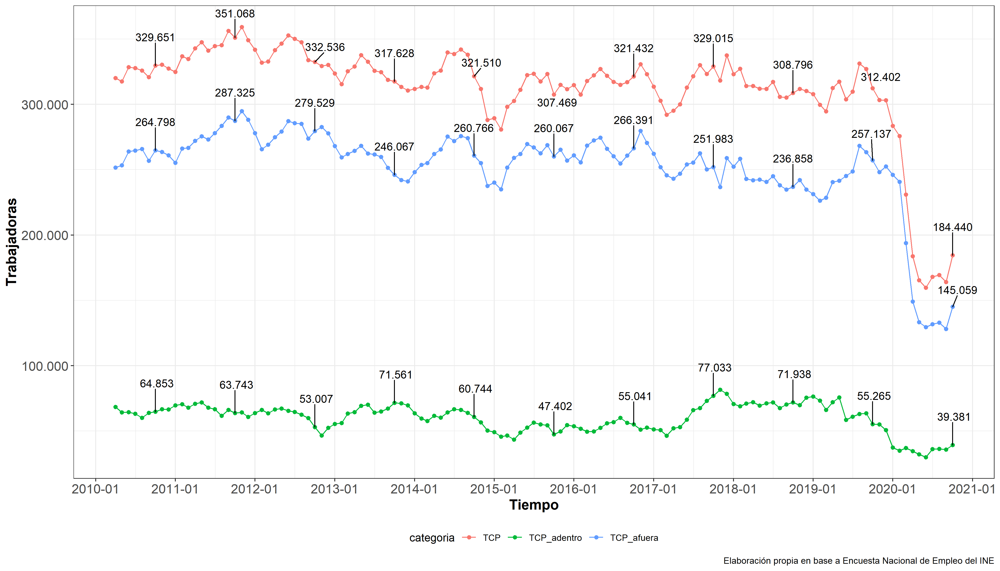
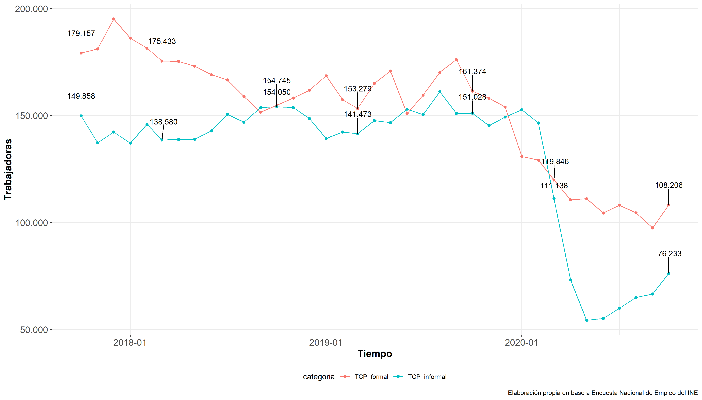

```{r setup, include=FALSE}
knitr::opts_chunk$set(echo = TRUE)
library(ggplot2); theme_set(theme_bw() + theme(legend.position="bottom",
      axis.text=element_text(size=13),
      axis.title=element_text(size=14,face="bold"),
      plot.title = element_text(size=14,face="bold")))

options(scipen=999)

library(knitr)
knit_hooks$set(inline = function(x) {
  prettyNum(x, 
            big.mark=".",
            decimal.mark = ",")
})
```


```{r include=FALSE, message = FALSE, warning = FALSE}
## Anotar cuestiones generales
mes_central<-"octubre"
n_boletin<-"quinto"

```


El presente boletín es el `r n_boletin` de una serie de informes elaborados por la **Federación de Trabajadoras de Casa Particular de Chile**. Estos buscan monitorear la situación y evolución del empleo en el sector del servicio doméstico remunerado, con el propósito de promover el empleo de calidad y la seguridad económica para el sector, sobre todo frente a los impactos que ha generado la pandemia del COVID-19 sobre las trabajadoras de casa particular. En esta primera edición se grafican y analizan los datos de la [**Encuesta Nacional de Empleo del Instituto Nacional de Estadísticas**](https://www.ine.cl/estadisticas/sociales/mercado-laboral/ocupacion-y-desocupacion), particularmente los que refieren al número de ocupados en el sector y al número de informales dentro del mismo.

```{r include=FALSE, message = FALSE, warning = FALSE}
library(tidyverse)
library(readxl)
library(srvyr)
library(dplyr)
library(survey)
library(ggpubr)
library(haven)
library(lubridate)
library(scales)
library(ggrepel)
library(openxlsx)
```

```{r  include=FALSE, message = FALSE, warning = FALSE}
#mam<-read_excel("../Input/Tabulados ENE/serie.xlsx",sheet = 4)

mam<-read.xlsx("http://www.ine.cl/docs/default-source/ocupacion-y-desocupacion/cuadros-estadisticos/series-de-tiempo-nueva-calibraci%C3%B3n-proyecciones-de-poblaci%C3%B3n-censo-2017/serie-categor%C3%ADa-en-la-ocupaci%C3%B3n.xlsx?sfvrsn=70dc54db_24",sheet = 4)

colnames(mam)<-mam[5,]
mam<-mam[c(7:(nrow(mam)-9)),c(1,2,4,6,8,10,12,14,16,18,20,22,24,26)]

colnames(mam)<-c("ano",
                 "trimestre",
                 "ocupados",
                 "independientes",
                 "independientes_empleadores)",
                 "independientes_cuenta_propia",
                 "independientes_familiar",
                 "dependientes",
                 "asalariados",
                 "asalariados_privado",
                 "asalariados_publico",
                 "TCP",
                 "TCP_afuera",
                 "TCP_adentro")

mam<-mam %>% mutate(mes=case_when(trimestre == "Ene - Mar"~ 2,
                             trimestre == "Feb - Abr"~ 3,
                             trimestre == "Mar - May"~ 4,
                             trimestre == "Abr - Jun"~ 5,
                             trimestre == "May -Jul"~ 6,
                             trimestre == "Jun - Ago"~ 7,
                             trimestre == "Jul - Sep"~ 8,
                             trimestre == "Ago - Oct"~ 9,
                             trimestre == "Sep - Nov"~ 10,
                             trimestre == "Oct - Dic"~ 11,
                             trimestre == "Nov - Ene"~ 12,
                             trimestre == "Dic - Feb"~  1))


mam<-mam %>% mutate(t=ymd(paste(ano,"-",mes,"-",1,sep="")))

mam
```

```{r include=FALSE, message = FALSE, warning = FALSE}
#inf<-read_excel("../Input/Tabulados Informalidad/serie2.xlsx",sheet = 4)

inf<-read.xlsx("https://www.ine.cl/docs/default-source/informalidad-y-condiciones-laborales/cuadros-estadisticos/series-trimestrales/series-de-tiempo-nueva-calibraci%C3%B3n-proyecciones-de-poblaci%C3%B3n-censo-2017/ocupados-formales-e-informales-por-categor%C3%ADa-en-la-ocupaci%C3%B3n.xlsx?sfvrsn=ee2da3dd_31",sheet = 4)

inf<-inf[c(7:(nrow(inf)-6)),c(1,2,4,6,8,10,12,14,16,18,20,22,24,26,28)]

colnames(inf)<-c("ano",
                 "trimestre",
                 "Total de ocupados (formales)",
                 "Empleadores (formales)",
                 "Trabajadores por cuenta propia (formales)",
                 "Asalariados del sector privado (formales)",
                 "Asalariados del sector público (formales)",
                 "TCP_formal",
                 "Total de ocupados (informales)",		
                 "Empleadores (informales)"		,
                 "Trabajadores por cuenta propia (informales)",
                 "Trabajadores familiares no remunerados (informales)",
                 "Asalariados del sector privado (informales)",
                 "Asalariados del sector público (informales)",
                 "TCP_informal")

inf<-inf %>% mutate(mes=case_when(trimestre == "Ene - Mar"~ 2,
                                  trimestre == "Feb - Abr"~ 3,
                                  trimestre == "Mar - May"~ 4,
                                  trimestre == "Abr - Jun"~ 5,
                                  trimestre == "May -Jul"~ 6,
                                  trimestre == "Jun - Ago"~ 7,
                                  trimestre == "Jul - Sep"~ 8,
                                  trimestre == "Ago - Oct"~ 9,
                                  trimestre == "Sep - Nov"~ 10,
                                  trimestre == "Oct - Dic"~ 11,
                                  trimestre == "Nov - Ene"~ 12,
                                  trimestre == "Dic - Feb"~  1))


inf<-inf %>% mutate(t=ymd(paste(ano,"-",mes,"-",1,sep="")))

```

Como principales resultados se pueden destacar:

> En un año las trabajadoras de casa particular ocupadas han disminuido en prácticamente la mitad por efecto del COVID-19 (`r round((((round(as.numeric(mam[nrow(mam),12])*1000))-(round(as.numeric(mam[nrow(mam)-12,12])*1000)))/(round(as.numeric(mam[nrow(mam)-12,12])*1000)))*100,1)`%). Si a mediados de 2019 estas eran `r round(as.numeric(mam[nrow(mam)-12,12])*1000)` a lo largo de Chile, actualmente estas llegan a solamente a `r round(as.numeric(mam[nrow(mam),12])*1000)`. Respecto al trimestre anterior, se observa una recuperación en la ocupación (`r round((((round(as.numeric(mam[nrow(mam),12])*1000))-(round(as.numeric(mam[nrow(mam)-1,12])*1000)))/(round(as.numeric(mam[nrow(mam)-1,12])*1000)))*100,1)`%). 

> La recuperación de la ocupación en el sector es clara y permanente desde junio, pero la mayor parte de esta recuperación se explica por la recuperación del empleo informal. En el sector informal, desde junio hasta la fecha se crearon 21.070 puestos de trabajo, mientras que en el formal solamente se han creado 3.750. De cada 100 nuevos puestos de trabajo, solamente 15 son formales. 


\newpage

# Empleo Nacional

```{r include=FALSE, message = FALSE, warning = FALSE}

#### TCP general, adentro y afuera -   con   scale_x_date() ####

g1<-mam %>%
  select(t,trimestre,TCP,TCP_afuera,TCP_adentro) %>% gather(categoria,trabajadores,-c(t,trimestre)) %>%
  mutate(trabajadores=as.numeric(trabajadores)*1000) %>%
  ggplot(aes( x = t, y = trabajadores, fill = categoria, color = categoria)) +
  geom_line() + geom_point()  +
  scale_y_continuous(labels=function(x) format(x, big.mark = ".", scientific = FALSE)) +
  scale_x_date(labels = date_format("%Y-%m"),
               breaks='1 years') + labs(x="Tiempo",
       y = "Trabajadoras",
       caption = "Elaboración propia en base a Encuesta Nacional de Empleo del INE") +
  geom_text_repel(aes(label=ifelse(trimestre=="Sep - Nov", format(round(trabajadores), big.mark = ".", scientific = FALSE),"")),
            vjust=-3,colour="black")

ggsave(plot = g1,
  filename = "../Output/Gráficos/Gráfico1_SON.png",
  device = "png",
  dpi = "retina",
  units = "cm",
  width = 35,
  height = 20)

```


Desde `r mes_central` de 2019 a `r mes_central` de 2020 las trabajadoras ocupadas en el sector bajan en un `r round((((round(as.numeric(mam[nrow(mam),12])*1000))-(round(as.numeric(mam[nrow(mam)-12,12])*1000)))/(round(as.numeric(mam[nrow(mam)-12,12])*1000)))*100,1)`%. En otras palabras, `r round(as.numeric(mam[nrow(mam),12])*1000)-round(as.numeric(mam[nrow(mam)-12,12])*1000)` trabajadoras perdieron el empleo en un año (Gráfico 1). La tasa de disminución de las ocupadas puertas adentro (color verde) y puertas afuera (color azul) es similar en el último año, cerca de la mitad de los empleos en los dos sub sectores se perdieron. Actualmente a nivel nacional se registran `r round(as.numeric(mam[nrow(mam),14])*1000)` trabajadores puertas adentro y `r round(as.numeric(mam[nrow(mam),13])*1000)` trabajadoras puertas afuera trabajando. En el presente trimestre se comienza se deja de observar la recuperación del empleo en el sector, en tanto este baja en `r (round(as.numeric(mam[nrow(mam)-1,12])*1000))-(round(as.numeric(mam[nrow(mam),12])*1000))` trabajadoras respecto de agosto (`r round((((round(as.numeric(mam[nrow(mam)-1,12])*1000))-(round(as.numeric(mam[nrow(mam),12])*1000)))/(round(as.numeric(mam[nrow(mam)-1,12])*1000)))*100,1)`%).




\newpage
# Informalidad Nacional

```{r include=FALSE, message = FALSE, warning = FALSE}

g2<-inf %>%
  select(t,trimestre,
         TCP_formal,
         TCP_informal) %>%
  gather(categoria,trabajadores,-c(t,trimestre)) %>%
  mutate(trabajadores=as.numeric(trabajadores)*1000) %>%
  ggplot(aes( x = t, y = trabajadores, fill = categoria, color = categoria)) +
  geom_line() + geom_point() +
  scale_y_continuous(labels=function(x) format(x, big.mark = ".", scientific = FALSE)) +
  scale_x_date(labels = date_format("%Y-%m"),
               breaks='1 years') +
  labs(x="Tiempo",
       y = "Trabajadoras",
       caption = "Elaboración propia en base a Encuesta Nacional de Empleo del INE") +
  geom_text_repel(aes(label=ifelse(trimestre%in%c("Sep - Nov","Feb - Abr"), format(round(trabajadores), big.mark = ".", scientific = FALSE),"")),
                  vjust=-3,colour="black")

ggsave(plot = g2,
  filename = "../Output/Gráficos/Gráfico2_SON.png",
  device = "png",
  dpi = "retina",
  units = "cm",
  width = 35,
  height = 20)

```


En el último año 5 de cada 10 trabajadoras de casa particular informales perdieron su trabajo en un año (`r round((as.numeric(inf[nrow(inf)-12,15])-as.numeric(inf[nrow(inf),15]))/as.numeric(inf[nrow(inf)-12,15])*100,1)`%), pasando de `r round(as.numeric(inf[nrow(inf)-12,15])*1000)` trabajadoras a `r round(as.numeric(inf[nrow(inf),15])*1000)` trabajadoras. En contrastre, 3 de cada 10 trabajadoras formales (`r round((as.numeric(inf[nrow(inf)-12,8])-as.numeric(inf[nrow(inf),8]))/as.numeric(inf[nrow(inf)-12,8])*100,1)`%) perdieron su empleo en el último año (pasaron de `r round(as.numeric(inf[nrow(inf)-12,8])*1000)` a `r round(as.numeric(inf[nrow(inf),15])*1000)`). El sector formal resistió de mejor manera los efectos del COVID-19. Sin embargo, la recuperación de este último ha sido muy lenta. La mayor parte de la recuperación del sector, observada desde junio, se debe al crecimiento del empleo informal. En el sector informal, desde junio hasta la fecha se crearon 21.070 puestos de trabajo, mientras que en el formal solamente se han creado 3.750. De cada 100 nuevos puestos de trabajo, solamente 15 son formales. 



# Autores

Este boletín ha sido elaborado por los asesores técnicos de la Federación Nacional de Sindicatos de Trabajadoras de Casa Particular.

- [Nicolás Ratto Ribó](mailto:"nicolas.ratto@ug.uchile.cl")
  - Sociólogo y magíster en Ciencias Sociales, Universidad de Chile.

- [Valentina Andrade de la Horra](mailto:"valentina.vasquez.a@uchile.cl")
  - Licenciada en Sociología, Universidad de Chile.
  
El repositorio de los informes se puede consultar en [Github](https://github.com/nicolasrattor/BOLETIN-EMPLEO-FESINTRACAP).
