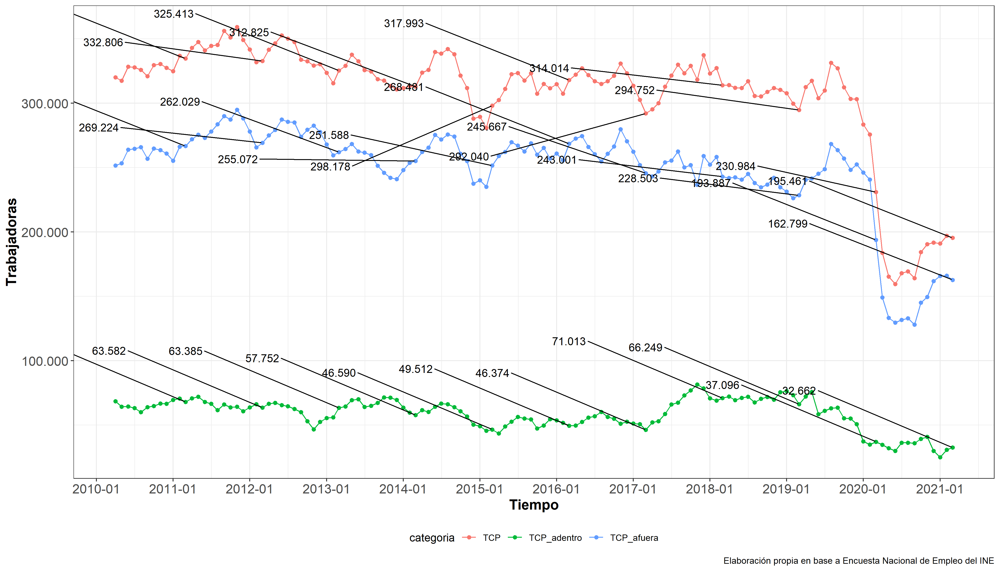
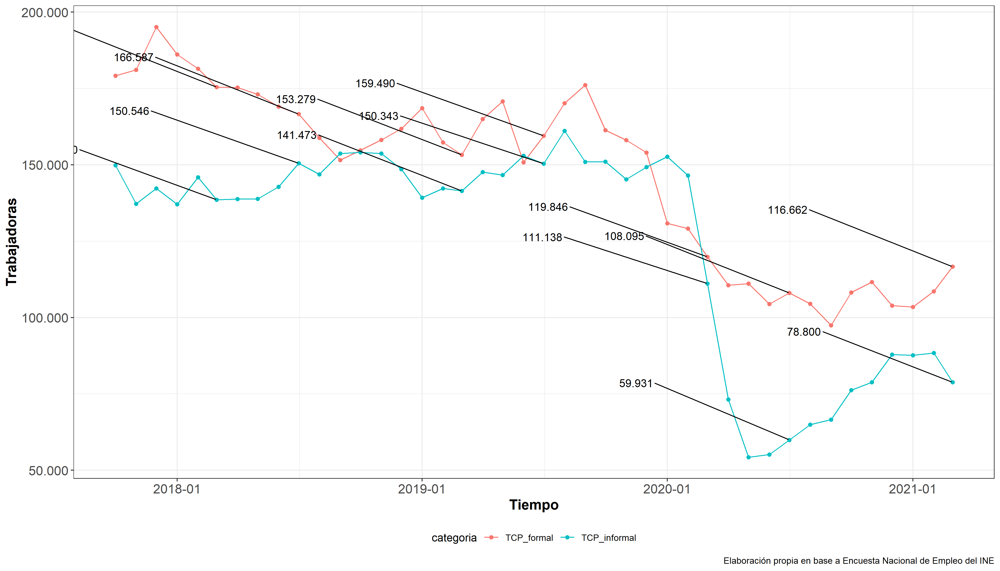

```{r setup, include=FALSE}
knitr::opts_chunk$set(echo = TRUE)
library(ggplot2); theme_set(theme_bw() + theme(legend.position="bottom",
      axis.text=element_text(size=13),
      axis.title=element_text(size=14,face="bold"),
      plot.title = element_text(size=14,face="bold")))

options(scipen=999)

library(knitr)
knit_hooks$set(inline = function(x) {
  prettyNum(x, 
            big.mark=".",
            decimal.mark = ",")
})
```


```{r include=FALSE, message = FALSE, warning = FALSE}
## Anotar cuestiones generales
mes_central<-"marzo"
n_boletin<-"décimo"

```


El presente boletín es el `r n_boletin` de una serie de informes elaborados por la **Federación de Trabajadoras de Casa Particular de Chile**. Estos buscan monitorear la situación y evolución del empleo en el sector del servicio doméstico remunerado, con el propósito de promover el empleo de calidad y la seguridad económica para el sector, sobre todo frente a los impactos que ha generado la pandemia del COVID-19 sobre las trabajadoras de casa particular. En esta primera edición se grafican y analizan los datos de la [**Encuesta Nacional de Empleo del Instituto Nacional de Estadísticas**](https://www.ine.cl/estadisticas/sociales/mercado-laboral/ocupacion-y-desocupacion), particularmente los que refieren al número de ocupados en el sector y al número de informales dentro del mismo.

```{r include=FALSE, message = FALSE, warning = FALSE}
library(tidyverse)
library(readxl)
library(srvyr)
library(dplyr)
library(survey)
library(ggpubr)
library(haven)
library(lubridate)
library(scales)
library(ggrepel)
library(openxlsx)
```

```{r  include=FALSE, message = FALSE, warning = FALSE}
#mam<-read_excel("../Input/Tabulados ENE/serie.xlsx",sheet = 4)

mam<-read.xlsx("http://www.ine.cl/docs/default-source/ocupacion-y-desocupacion/cuadros-estadisticos/series-de-tiempo-nueva-calibraci%C3%B3n-proyecciones-de-poblaci%C3%B3n-censo-2017/serie-categor%C3%ADa-en-la-ocupaci%C3%B3n.xlsx?sfvrsn=70dc54db_24",sheet = 4)

colnames(mam)<-mam[3,]
mam<-mam[c(7:(nrow(mam)-9)),c(1,2,4,6,8,10,12,14,16,18,20,22,24,26)]

colnames(mam)<-c("ano",
                 "trimestre",
                 "ocupados",
                 "independientes",
                 "independientes_empleadores)",
                 "independientes_cuenta_propia",
                 "independientes_familiar",
                 "dependientes",
                 "asalariados",
                 "asalariados_privado",
                 "asalariados_publico",
                 "TCP",
                 "TCP_afuera",
                 "TCP_adentro")

mam<-mam %>% mutate(mes=case_when(trimestre == "Ene - Mar"~ 2,
                             trimestre == "Feb - Abr"~ 3,
                             trimestre == "Mar - May"~ 4,
                             trimestre == "Abr - Jun"~ 5,
                             trimestre == "May -Jul"~ 6,
                             trimestre == "Jun - Ago"~ 7,
                             trimestre == "Jul - Sep"~ 8,
                             trimestre == "Ago - Oct"~ 9,
                             trimestre == "Sep - Nov"~ 10,
                             trimestre == "Oct - Dic"~ 11,
                             trimestre == "Nov - Ene"~ 12,
                             trimestre == "Dic - Feb"~  1))


mam<-mam %>% mutate(t=ymd(paste(ano,"-",mes,"-",1,sep="")))

mam
```

```{r include=FALSE, message = FALSE, warning = FALSE}
#inf<-read_excel("../Input/Tabulados Informalidad/serie2.xlsx",sheet = 4)

inf<-read.xlsx("https://www.ine.cl/docs/default-source/informalidad-y-condiciones-laborales/cuadros-estadisticos/series-trimestrales/series-de-tiempo-nueva-calibraci%C3%B3n-proyecciones-de-poblaci%C3%B3n-censo-2017/ocupados-formales-e-informales-por-categor%C3%ADa-en-la-ocupaci%C3%B3n.xlsx?sfvrsn=ee2da3dd_31",sheet = 4)

inf<-inf[c(7:(nrow(inf)-6)),c(1,2,4,6,8,10,12,14,16,18,20,22,24,26,28)]

colnames(inf)<-c("ano",
                 "trimestre",
                 "Total de ocupados (formales)",
                 "Empleadores (formales)",
                 "Trabajadores por cuenta propia (formales)",
                 "Asalariados del sector privado (formales)",
                 "Asalariados del sector público (formales)",
                 "TCP_formal",
                 "Total de ocupados (informales)",		
                 "Empleadores (informales)"		,
                 "Trabajadores por cuenta propia (informales)",
                 "Trabajadores familiares no remunerados (informales)",
                 "Asalariados del sector privado (informales)",
                 "Asalariados del sector público (informales)",
                 "TCP_informal")

inf<-inf %>% mutate(mes=case_when(trimestre == "Ene - Mar"~ 2,
                                  trimestre == "Feb - Abr"~ 3,
                                  trimestre == "Mar - May"~ 4,
                                  trimestre == "Abr - Jun"~ 5,
                                  trimestre == "May -Jul"~ 6,
                                  trimestre == "Jun - Ago"~ 7,
                                  trimestre == "Jul - Sep"~ 8,
                                  trimestre == "Ago - Oct"~ 9,
                                  trimestre == "Sep - Nov"~ 10,
                                  trimestre == "Oct - Dic"~ 11,
                                  trimestre == "Nov - Ene"~ 12,
                                  trimestre == "Dic - Feb"~  1))


inf<-inf %>% mutate(t=ymd(paste(ano,"-",mes,"-",1,sep="")))

```

Como principales resultados se pueden destacar:

> En un año las trabajadoras de casa particular ocupadas han disminuido en un `r round((((round(as.numeric(mam[nrow(mam),12])*1000))-(round(as.numeric(mam[nrow(mam)-12,12])*1000)))/(round(as.numeric(mam[nrow(mam)-12,12])*1000)))*100,1)`%. Si a inicios de 2020 estas eran `r round(as.numeric(mam[nrow(mam)-12,12])*1000)` a lo largo de Chile, actualmente estas llegan a solamente a `r round(as.numeric(mam[nrow(mam),12])*1000)`. Respecto al trimestre anterior, se observa una leve caída en la ocupación (`r round((((round(as.numeric(mam[nrow(mam),12])*1000))-(round(as.numeric(mam[nrow(mam)-1,12])*1000)))/(round(as.numeric(mam[nrow(mam)-1,12])*1000)))*100,1)`%), que afecta con más fuerza a las informales que a las formales.

> La recuperación de la ocupación en el sector es clara desde junio, pero la mayor parte de esta recuperación se explica por la recuperación del empleo informal. En el sector informal, desde junio de 2020 hasta la fecha se crearon 23.640 puestos de trabajo, mientras que en el formal estos han aumentado en cerca de 12.000.


\newpage

# Empleo Nacional

```{r include=FALSE, message = FALSE, warning = FALSE}

#### TCP general, adentro y afuera -   con   scale_x_date() ####

g1<-mam %>%
  select(t,trimestre,TCP,TCP_afuera,TCP_adentro) %>% gather(categoria,trabajadores,-c(t,trimestre)) %>%
  mutate(trabajadores=as.numeric(trabajadores)*1000) %>%
  ggplot(aes( x = t, y = trabajadores, fill = categoria, color = categoria)) +
  geom_line() + geom_point()  +
  scale_y_continuous(labels=function(x) format(x, big.mark = ".", scientific = FALSE)) +
  scale_x_date(labels = date_format("%Y-%m"),
               breaks='1 years') + labs(x="Tiempo",
       y = "Trabajadoras",
       caption = "Elaboración propia en base a Encuesta Nacional de Empleo del INE") +
  geom_text_repel(aes(label=ifelse(trimestre=="Feb - Abr", format(round(trabajadores), big.mark = ".", scientific = FALSE),"")),
            vjust=-3,colour="black")

ggsave(plot = g1,
  filename = "../Output/Gráficos/Gráfico1_FMA2021.png",
  device = "png",
  dpi = "retina",
  units = "cm",
  width = 35,
  height = 20)

```


Desde `r mes_central` de 2020 a `r mes_central` de 2021 las trabajadoras ocupadas en el sector bajan en un `r round((((round(as.numeric(mam[nrow(mam),12])*1000))-(round(as.numeric(mam[nrow(mam)-12,12])*1000)))/(round(as.numeric(mam[nrow(mam)-12,12])*1000)))*100,1)`%. En otras palabras, `r round(as.numeric(mam[nrow(mam),12])*1000)-round(as.numeric(mam[nrow(mam)-12,12])*1000)` trabajadoras perdieron el empleo en un año (Gráfico 1). La tasa de disminución de las ocupadas puertas adentro (color verde) y puertas afuera (color azul) es similar en el último año, cerca de la mitad de los empleos en los dos sub sectores se perdieron. Actualmente a nivel nacional se registran `r round(as.numeric(mam[nrow(mam),14])*1000)` trabajadores puertas adentro y `r round(as.numeric(mam[nrow(mam),13])*1000)` trabajadoras puertas afuera trabajando.




\newpage
# Informalidad Nacional

```{r include=FALSE, message = FALSE, warning = FALSE}

g2<-inf %>%
  select(t,trimestre,
         TCP_formal,
         TCP_informal) %>%
  gather(categoria,trabajadores,-c(t,trimestre)) %>%
  mutate(trabajadores=as.numeric(trabajadores)*1000) %>%
  ggplot(aes( x = t, y = trabajadores, fill = categoria, color = categoria)) +
  geom_line() + geom_point() +
  scale_y_continuous(labels=function(x) format(x, big.mark = ".", scientific = FALSE)) +
  scale_x_date(labels = date_format("%Y-%m"),
               breaks='1 years') +
  labs(x="Tiempo",
       y = "Trabajadoras",
       caption = "Elaboración propia en base a Encuesta Nacional de Empleo del INE") +
  geom_text_repel(aes(label=ifelse(trimestre%in%c("Feb - Abr","Jun - Ago"), format(round(trabajadores), big.mark = ".", scientific = FALSE),"")),
                  vjust=-3,colour="black")

ggsave(plot = g2,
  filename = "../Output/Gráficos/Gráfico2_FMA2021.png",
  device = "png",
  dpi = "retina",
  units = "cm",
  width = 35,
  height = 20)

```


En el último año 3 de cada 10 trabajadoras de casa particular informales perdieron su trabajo en un año (`r round((as.numeric(inf[nrow(inf)-12,15])-as.numeric(inf[nrow(inf),15]))/as.numeric(inf[nrow(inf)-12,15])*100,1)`%), pasando de `r round(as.numeric(inf[nrow(inf)-12,15])*1000)` trabajadoras a `r round(as.numeric(inf[nrow(inf),15])*1000)` trabajadoras. En contrastre, un bajísimo porcentaje de trabajadoras formales (`r round((as.numeric(inf[nrow(inf)-12,8])-as.numeric(inf[nrow(inf),8]))/as.numeric(inf[nrow(inf)-12,8])*100,1)`%) perdieron su empleo en el último año (pasaron de `r round(as.numeric(inf[nrow(inf)-12,8])*1000)` a `r round(as.numeric(inf[nrow(inf),8])*1000)`). El sector formal se encuentra resistiendo de mejor manera a la crisis económica. Sin embargo, la recuperación de este último ha sido muy lenta.





$$\\[1in]$$


# Informalidad comparada en los últimos 11 años

Hasta antes del inicio de la pandemia, existía una alta informalidad en el trabajo doméstico que se mantenía relativamente estable en torno al 50% de las trabajadoras. Sin embargo, llama la atención una baja discreta luego de la entrada en vigor de la Ley 20.786 (marzo 2015), en donde se observa una disminución temporal de la informalidad en el sector de cerca de un 10%. Esta situación es muy diferente a la de las asalariadas del sector privado, las que se mantienen con una informalidad estable en torno al 17% durante los años 2015 y 2016. Sin embargo, desde inicios del año 2018 la informalidad en el sector vuelve a aumentar, pareciendo haber retornado a los niveles anteriores al año 2015 hasta el inicio de la pandemia. En el siguiente gráfico, extraido de [Andrade, et al. (2021)](https://nicolasrattor.github.io/prepint_persistente_informalidad/), se puede observar la evolución de los porcentajes de informalidad en el grupos de las trabajadoras del servicio doméstico (línea negra) y de las asalariadas del sector privado (línea morada). Desde el inicio de la pandemia la informalidad en el sector de las trabajadoras del servicio doméstico baja por la caída en la ocupación de este subsector informal, en una proporción superior a la del subsector formal. Desde diciembre de 2020 el porcentaje de informales en el subsector informal del servicio doméstico remunerado aumenta a poco más del 45%, manteniéndose sobre este nivel hasta febrero de 2021, para volver a bajar a un 40% en marzo 2021. 


\newpage

# Autores

Este boletín ha sido elaborado por los asesores técnicos de la Federación Nacional de Sindicatos de Trabajadoras de Casa Particular.

- [Nicolás Ratto Ribó](mailto:"nicolas.ratto@ug.uchile.cl")
  - Sociólogo y magíster en Ciencias Sociales, Universidad de Chile.

- [Valentina Andrade de la Horra](mailto:"valentina.vasquez.a@uchile.cl")
  - Licenciada en Sociología, Universidad de Chile.
  
El repositorio de los informes se puede consultar en [Github](https://github.com/nicolasrattor/BOLETIN-EMPLEO-FESINTRACAP).
