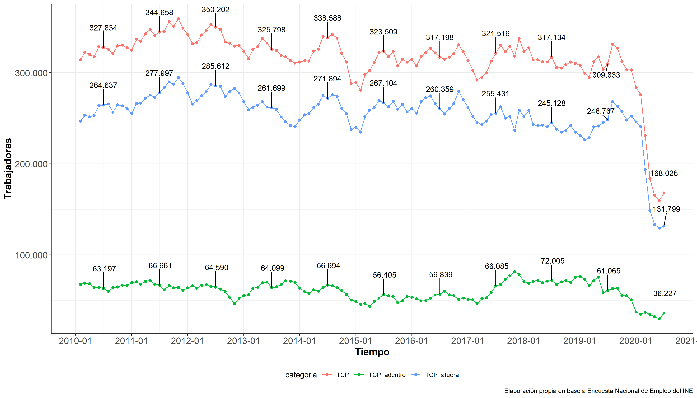
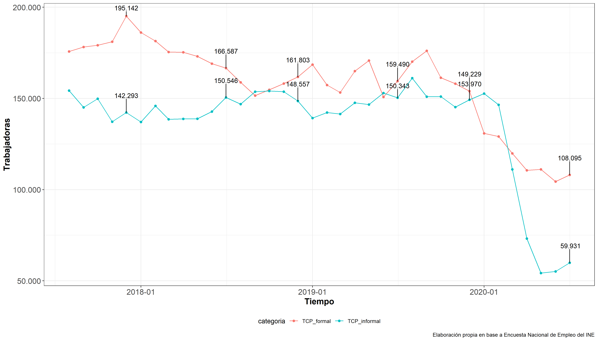

```{r setup, include=FALSE}
knitr::opts_chunk$set(echo = TRUE)
library(ggplot2); theme_set(theme_bw() + theme(legend.position="bottom",
      axis.text=element_text(size=13),
      axis.title=element_text(size=14,face="bold"),
      plot.title = element_text(size=14,face="bold")))
```

El presente boletín es el primero de una serie de informes elaborados por la **Federación de Trabajadoras de Casa Particular de Chile**. Estos buscan monitorear la situación y evolución del empleo en el sector del servicio doméstico remunerado, con el propósito de promover el empleo de calidad y la seguridad económica para el sector, sobre todo frente a los impactos que ha generado la pandemia del COVID-19 sobre las trabajadoras de casa particular. En esta primera edición se grafican y analizan los datos de la [**Encuesta Nacional de Empleo del Instituto Nacional de Estadísticas**](https://www.ine.cl/estadisticas/sociales/mercado-laboral/ocupacion-y-desocupacion), particularmente los que refieren al número de ocupados en el sector y al número de informales dentro del mismo.

Como principales resultados se pueden destacar:

>* En un año las trabajadoras de casa particular ocupadas han disminuido en prácticamente la mitad por efecto del COVID-19 (45,8%). Si a mediados de 2019 estas eran más de 300.000 a lo largo de Chile, actualmente estas llegan a solamente un poco más de 150.000. Respecto al trimestre anterior, se observa un leve aumento en la ocupación (5,3%). 

>* 6 de cada 10 trabajadoras de casa particular informales perdieron su trabajo en el último año, mientras que solamente 3 de cada 10 formales lo hicieron. Después de años insistiendo en la necesidad de reducir la alta informalidad en el sector (cerca de la mitad de las trabajadoras no tenía contrato ni cotizaba para la seguridad social), por efecto del COVID-19 la informalidad baja. Esta reducción no se debe a buenas políticas públicas o la formalización del trabajo, más bien son el resultado de la ausencia de protecciones.

```{r include=FALSE, message = FALSE, warning = FALSE}
library(tidyverse)
library(readxl)
library(srvyr)
library(dplyr)
library(survey)
library(ggpubr)
library(haven)
library(lubridate)
library(scales)
library(ggrepel)
```

\newpage

# Empleo Nacional

```{r  include=FALSE, message = FALSE, warning = FALSE}
mam<-read_excel("../Input/Tabulados ENE/serie.xlsx",sheet = 4)

colnames(mam)<-mam[5,]
mam<-mam[c(7:(nrow(mam)-12)),c(1,2,4,6,8,10,12,14,16,18,20,22,24,26)]

colnames(mam)<-c("ano",
                 "trimestre",
                 "ocupados",
                 "independientes",
                 "independientes_empleadores)",
                 "independientes_cuenta_propia",
                 "independientes_familiar",
                 "dependientes",
                 "asalariados",
                 "asalariados_privado",
                 "asalariados_publico",
                 "TCP",
                 "TCP_afuera",
                 "TCP_adentro")

mam<-mam %>% mutate(mes=case_when(trimestre == "Ene - Mar"~ 2,
                             trimestre == "Feb - Abr"~ 3,
                             trimestre == "Mar - May"~ 4,
                             trimestre == "Abr - Jun"~ 5,
                             trimestre == "May -Jul"~ 6,
                             trimestre == "Jun - Ago"~ 7,
                             trimestre == "Jul - Sep"~ 8,
                             trimestre == "Ago - Oct"~ 9,
                             trimestre == "Sep - Nov"~ 10,
                             trimestre == "Oct - Dic"~ 11,
                             trimestre == "Nov - Ene"~ 12,
                             trimestre == "Dic - Feb"~  1))


mam<-mam %>% mutate(t=ymd(paste(ano,"-",mes,"-",1,sep="")))

mam
```


```{r include=FALSE, message = FALSE, warning = FALSE}

#### TCP general, adentro y afuera -   con   scale_x_date() ####

g1<-mam %>%
  select(t,trimestre,TCP,TCP_afuera,TCP_adentro) %>% gather(categoria,trabajadores,-c(t,trimestre)) %>%
  mutate(trabajadores=as.numeric(trabajadores)*1000) %>%
  ggplot(aes( x = t, y = trabajadores, fill = categoria, color = categoria)) +
  geom_line() + geom_point()  +
  scale_y_continuous(labels=function(x) format(x, big.mark = ".", scientific = FALSE)) +
  scale_x_date(labels = date_format("%Y-%m"),
               breaks='1 years') + labs(x="Tiempo",
       y = "Trabajadoras",
       caption = "Elaboración propia en base a Encuesta Nacional de Empleo del INE") +
  geom_text_repel(aes(label=ifelse(trimestre=="Jun - Ago", format(round(trabajadores), big.mark = ".", scientific = FALSE),"")),
            vjust=-3,colour="black")

ggsave(plot = g1,
  filename = "../Output/Gráficos/Gráfico1_JJA.png",
  device = "png",
  dpi = "retina",
  units = "cm",
  width = 35,
  height = 20)

```


Desde julio de 2019 a julio de 2020 las trabajadoras ocupadas en el sector bajan en un 45,8%. En otras palabras, 141.807 trabajadoras perdieron el empleo en un año (Gráfico 1). La tasa de disminución de las ocupadas puertas adentro (color verde) y puertas afuera (color azul) es similar en el último año, cerca de la mitad de los empleos en los dos sub sectores se perderon. Actualmente a nivel nacional se registran 36.227 trabajadores puertas adentro y 131.799 trabajadoras puertas afuera trabajando. En el presente trimestre se comienza a observar una recuperación del empleo en el sector, en tanto este crece en 8.405 trabajadoras (5,3%).




\newpage
# Informalidad Nacional

```{r include=FALSE, message = FALSE, warning = FALSE}
mam<-read_excel("../Input/Tabulados Informalidad/serie2.xlsx",sheet = 4)

mam<-mam[7:42,]
mam<-mam[,c(1,2,4,6,8,10,12,14,16,18,20,22,24,26,28)]

colnames(mam)<-c("ano",
                 "trimestre",
                 "Total de ocupados (formales)",
                 "Empleadores (formales)",
                 "Trabajadores por cuenta propia (formales)",
                 "Asalariados del sector privado (formales)",
                 "Asalariados del sector público (formales)",
                 "TCP_formal",
                 "Total de ocupados (informales)",		
                 "Empleadores (informales)"		,
                 "Trabajadores por cuenta propia (informales)",
                 "Trabajadores familiares no remunerados (informales)",
                 "Asalariados del sector privado (informales)",
                 "Asalariados del sector público (informales)",
                 "TCP_informal")

mam<-mam %>% mutate(mes=case_when(trimestre == "Ene - Mar"~ 2,
                                  trimestre == "Feb - Abr"~ 3,
                                  trimestre == "Mar - May"~ 4,
                                  trimestre == "Abr - Jun"~ 5,
                                  trimestre == "May -Jul"~ 6,
                                  trimestre == "Jun - Ago"~ 7,
                                  trimestre == "Jul - Sep"~ 8,
                                  trimestre == "Ago - Oct"~ 9,
                                  trimestre == "Sep - Nov"~ 10,
                                  trimestre == "Oct - Dic"~ 11,
                                  trimestre == "Nov - Ene"~ 12,
                                  trimestre == "Dic - Feb"~  1))


mam<-mam %>% mutate(t=ymd(paste(ano,"-",mes,"-",1,sep="")))

```


```{r include=FALSE, message = FALSE, warning = FALSE}

g2<-mam %>%
  select(t,trimestre,
         TCP_formal,
         TCP_informal) %>%
  gather(categoria,trabajadores,-c(t,trimestre)) %>%
  mutate(trabajadores=as.numeric(trabajadores)*1000) %>%
  ggplot(aes( x = t, y = trabajadores, fill = categoria, color = categoria)) +
  geom_line() + geom_point() +
  scale_y_continuous(labels=function(x) format(x, big.mark = ".", scientific = FALSE)) +
  scale_x_date(labels = date_format("%Y-%m"),
               breaks='1 years') +
  labs(x="Tiempo",
       y = "Trabajadoras",
       caption = "Elaboración propia en base a Encuesta Nacional de Empleo del INE") +
  geom_text_repel(aes(label=ifelse(trimestre%in%c("Jun - Ago","Nov - Ene"), format(round(trabajadores), big.mark = ".", scientific = FALSE),"")),
                  vjust=-3,colour="black")

ggsave(plot = g2,
  filename = "../Output/Gráficos/Gráfico2_JJA.png",
  device = "png",
  dpi = "retina",
  units = "cm",
  width = 35,
  height = 20)

```


En el último año 6 de cada 10 trabajadoras de casa particular informales perdieron su trabajo, pasando de 150.343 trabajadoras a 59.931 trabajadoras. En contrastre, solamente 3 de cada 10 trabajadoras formales perdieron su empleo en el último año (pasaron de 159.490 a 108.095). Después de años insistiendo en la necesidad de reducir la alta informalidad en el sector, por efecto del COVID-19 y la ausencia de políticas de protección reales al empleo, la informalidad pasa de afectar a más del 50% de las trabajadoras a solamente un 35,7%. De cada 10 empleos perdidos interanualmente en el sector del trabajo doméstico asalariado, 6,4 corresponden a empleos informales. 



# Autores

Este boletín ha sido elaborado por los asesores técnicos de la Federación Nacional de Sindicatos de Trabajadoras de Casa Particular.

- [Nicolás Ratto Ribó](mailto:"nicolas.ratto@ug.uchile.cl")
  - Sociólogo y magíster en Ciencias Sociales, Universidad de Chile

- [Valentina Andrade de la Horra](mailto:"valentina.vasquez.a@uchile.cl")
  - Licenciada en Sociología, Universidad de Chile.
